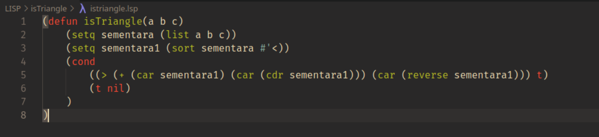

# Is Triangle?

Ini adalah program yang dibuat dengan bahasa pemrograman LISP. Dengan tujuan sebagai bahan pembelajaran dan untuk menentukan apakah 3 sisi segitiga yang di input oleh user itu memenuhi syarat untuk membentuk sebuah segitiga.

Berikut video cara membuatnya: <button><a href="https://youtu.be/Ti5kaYaNUJU">Klik Disini</a></button>

## How to use?

Berikut cara menggunakannya:
1. Buka CLISP.
2. Load file ini.
3. Ketikkan
    ```
    (istriangle a b c)
    ```
    Dengan a, b dan c adalah sisi-sisi segitiga yang yang akan dites. Contoh:
    ```
    (istriangle 1 2 3)
    ```
4. Tekan enter.
5. Akan memberikan output berupa boolean, yaitu t (true) atau nil (false). Selamat mencoba :)



## <b>About Me</b>

I'm a student at Del Institute of Technology. <br>
Bachelor of Informatics study program. <br>


<button><a href="https://www.instagram.com/gabrielhtg77/">My Instagram</a></button>
<br>
<button><a href="https://www.del.ac.id/">Institut Teknologi Del</a></button>